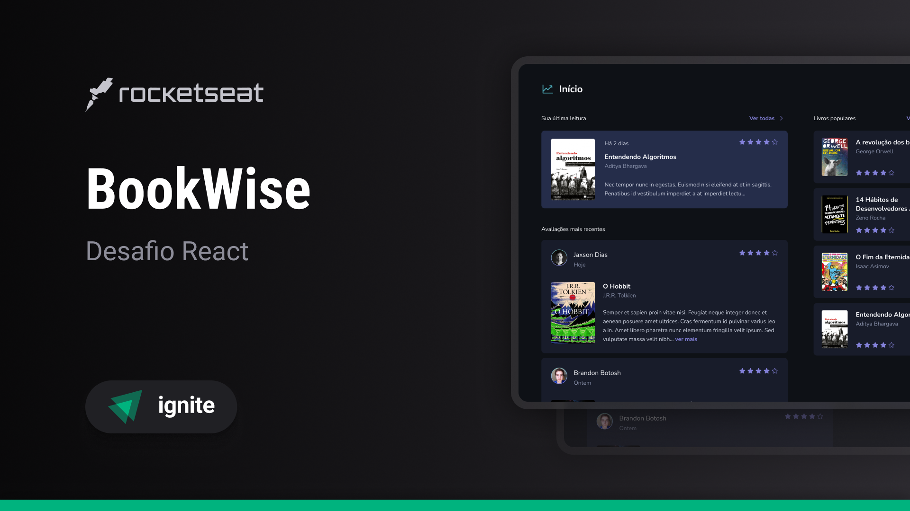

# Projeto BookWise - Plataforma de Recomendações para Leitores

Este é um projeto fullstack desenvolvido utilizando Next.js, Tailwind CSS, TypeScript, NextAuth, Prisma e SQLite. A plataforma BookWise foi criada para permitir que os leitores avaliem livros e vejam avaliações de outros leitores. Os usuários podem se autenticar usando suas contas do Google ou GitHub.

## Preview

Aqui está uma imagem de preview do projeto:



Esta imagem oferece uma prévia visual do projeto e suas principais características. Aproveite para conferir o projeto em ação!

<!-- ## Demonstração

Você pode conferir uma demonstração do projeto em produção através do seguinte link: [Link da Demo](https://sua-demo-aqui.com/) -->

Certifique-se de acessar o link acima para explorar o projeto em ação!

## Pré-requisitos

Certifique-se de ter as seguintes ferramentas instaladas em seu sistema:

- Node.js (v16 ou superior)

## Configuração

Siga as etapas abaixo para configurar e executar o projeto em sua máquina local:

1. Clone o repositório para sua máquina local:

```bash
git clone https://github.com/kevenpacheco/bookwise.git
```

2. Acesse o diretório do projeto:

```bash
cd bookwise
```

3. Instale as dependências do projeto:

```bash
# Instale as dependências do projeto usando NPM
npm install

# OU

# Instale as dependências do projeto usando Yarn
yarn install
```

4. Crie um arquivo `.env.local` na raiz do projeto e defina as seguintes variáveis de ambiente:

```bash
DATABASE_URL="url-do-banco-de-dados"
NEXTAUTH_SECRET='sua-nextauth-secret'
GITHUB_ID='seu-github-id'
GITHUB_SECRET='seu-github-secret'
GOOGLE_CLIENT_ID='seu-google-client-id'
GOOGLE_CLIENT_SECRET='seu-google-client-secret'
```

Certifique-se de substituir as informações relevantes pelas suas próprias.

5. Execute as migrações do banco de dados:

```bash
npx prisma migrate dev
```

6. Execute a seed para popular o banco de dados:

```bash
npx prisma db seed
```

7. Inicie o servidor de desenvolvimento:

```bash
npm run dev
```

O projeto estará sendo executado em `http://localhost:3000`.

## Uso

Após iniciar o servidor de desenvolvimento, acesse `http://localhost:3000` em seu navegador.

1. Faça login utilizando sua conta do Google ou GitHub.

2. Na plataforma, você poderá ver avaliações de livros feitas por outros leitores e também adicionar suas próprias avaliações.

## Tecnologias utilizadas

- [Next.js](https://nextjs.org/) - Framework de React para renderização do lado do servidor (SSR).
- [Tailwind CSS](https://tailwindcss.com/) - Biblioteca CSS para estilização rápida e responsiva.
- [TypeScript](https://www.typescriptlang.org/) - Superset tipado do JavaScript.
- [NextAuth](https://next-auth.js.org/) - Biblioteca para autenticação em Next.js.
- [Prisma](https://www.prisma.io/) - ORM (Object-Relational Mapping) para interagir com o banco de dados SQLite.
- SQLite - Banco de dados local para armazenamento dos dados do projeto.

## Contribuição

Se você deseja contribuir para este projeto, fique à vontade para enviar pull requests. Será um prazer receber sua contribuição!

## Licença

Este projeto está licenciado sob a [MIT License](LICENSE).
